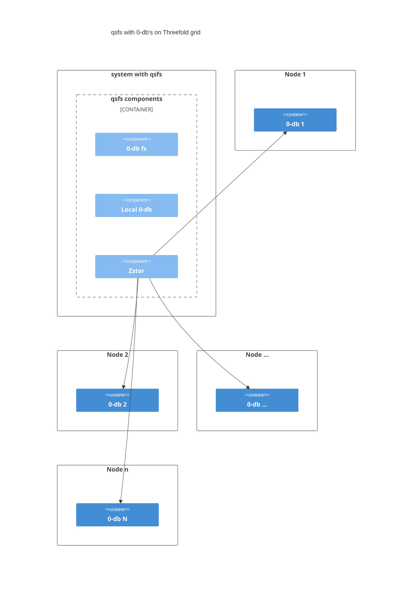

# QSFS

```mermaid
C4Component
title qsfs with 0-db's on Threefold grid 

Deployment_Node(qsfssystem, "system with qsfs",""){
    Container_Boundary(b,"qsfs components"){
        Component(zdbfs, "0-db fs")
        Component(localzorodb,"Local 0-db")
        Component(zstor, "Zstor")
    }
}

Deployment_Node(node1,"Node 1", ""){
    Container(zerodb1,"0-db 1")
}
Deployment_Node(node2,"Node 2", ""){
    Container(zerodb2,"0-db 2")
}
Deployment_Node(nodex,"Node ...", ""){ 
    Container(zerodbx,"0-db ...")
}

Deployment_Node(noden,"Node n", ""){
    Container(zerodbn,"0-db N")
}

Rel(zstor, zerodb1, "")
Rel(zstor, zerodb2, "")
Rel(zstor, zerodbx, "")
Rel(zstor, zerodbn, "")
```
